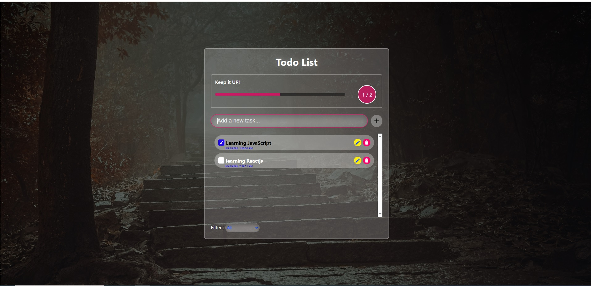

# 📝 React Todo List App

A beautiful and responsive Todo List application built with **React**.  
Designed with a modern UI and powered by `localStorage`, it helps you manage your daily tasks efficiently.



---

## 🚀 Features

- ✅ Add, edit and delete tasks
- ✅ Mark tasks as complete or incomplete
- ✅ Filter tasks (All, Done, Undone)
- ✅ Progress indicator with visual bar
- ✅ Persistent data using `localStorage`
- ✅ Fully responsive and modern glassmorphism design
- ✅ Clean and modular code with reusable components

---

## 🛠️ Tech Stack

- React (with Hooks)
- CSS3 (custom styles with modern UI)
- HTML5
- LocalStorage API

---

## 📂 Folder Structure

```
src/
├── components/
│   ├── TodoApp.js
│   ├── TodoInput.js
│   ├── TodoItem.js
│   └── ...
├── App.js
└── index.js
```

---

## 🧑‍💻 Developer

**Sajjad [Your Last Name]**  
Frontend Developer (React)  
📧 sajjad.k69@gmail.com
📍 Based in Urmia — Open to relocate to Tehran

---

## 📜 License

MIT License — Free to use and modify.
